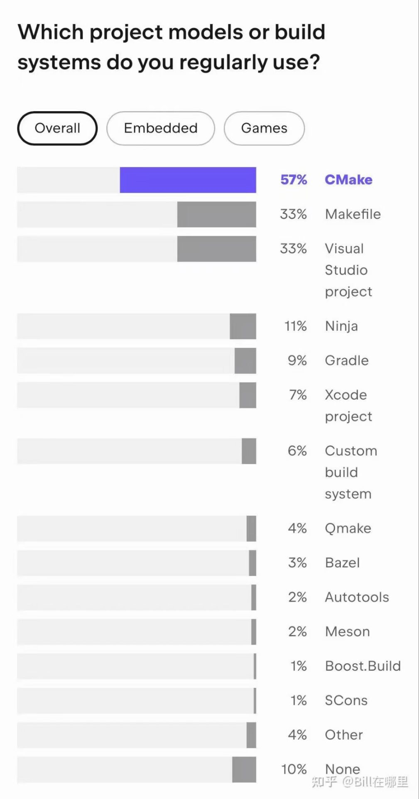

# 现代CMake教程
C++的复杂系统构建几乎都要用到CMake,虽然国内已有不少关于CMake的教程，但是很多缺少专业性，不够严谨，所以我们需要一个现代的、准确的CMake教程。
> 项目目前正在开发中[github仓库](https://github.com/CrossroadW/ModernCMake)



## 什么是CMake？
[CMake](https://cmake.org/) 是一个跨平台的开源[构建系统](#buildsystem)生成器(也称为[元构建工具](https://en.wikipedia.org/wiki/List_of_build_automation_software))，它能够为其他构建工具（如 Visual Studio、Make、Ninja、Xcode）生成配置文件（例如 project.sln、build.ninja、Makefile）  
CMake 的特色功能包括：
>- 跨平台支持：可以在不同的操作系统和编译器之间无缝切换。
>- Target-centric approach(以[目标](现代CMake的核心概念/#coreconcept)为中心)：能够自动检测文件间的依赖关系，减少手动操作。
>- 多种构建系统支持：支持生成 Visual Studio、Make、Ninja 等多种构建工具的配置文件。
>- 跨平台安装：使用相同的命令集，可以在 Linux、Windows 和 Mac 上安装软件包。
>- 支持调试CMake代码(Visual Studio、VScode):[第三方工具](https://microsoft.github.io/debug-adapter-protocol/implementors/tools/)


本质上，构建系统的任务是将源代码文件（如 .cpp）转换为可执行的二进制文件（如 .exe、.lib、.dll）。


## 为什么不直接使用编译器？
最简单的方法是直接通过命令行调用编译器，如 gcc、cl.exe、clang++ 等工具。但是，当代码库变得复杂时，仅靠命令行不够用了。
#### 单文件编译
对于单个文件的编译，只需一条命令：
```bash
g++ -o main.exe main.cpp
```
#### 多文件编译
当涉及多个源文件时，命令行更复杂：:
```bash
# examples/step1
$ tree
├── foo.cpp
├── foo.h
├── main.cpp
$ g++ -o foo.o -c foo.cpp
$ g++ -o main.o -c main.cpp 
$ g++ -o step1 main.o foo.o
$ ./step1 
43
```
此外，如果需要同时构建 Debug 和 Release 版本，或者链接外部库，命令行的复杂度将迅速提升，效率也会大大降低。

下一章[环境搭建](环境搭建.md)
------
<br>

<br>
## 概念解释


<a id="buildsystem"></a>
#### [构建](https://en.wikipedia.org/wiki/Software_build)与构建系统(buildsystem):  
> 简单来说，软件开发中的构建是将源代码文件“翻译”为可执行二进制代码文件的过程；而构建系统是一组用于辅助和自动化构建过程的软件工具集合。  
> 以下是常见的构建系统:  
>> [Ninja build system](https://ninja-build.org/manual.html)  
>> [cmake-buildsystem](https://cmake.org/cmake/help/latest/manual/cmake-buildsystem.7.html#introduction)  
>> [bazel.build](https://bazel.build/about/intro?hl=zh-cn)  
>> [Make](https://www.gnu.org/software/make/)、[Maven](https://maven.apache.org/what-is-maven.html) 和 [Gradle](https://gradle.org/)  


<a id="metabuildsystem"></a>
#### 元构建系统(metabuildsystem):
元构建系统即一个生成其他构建系统的构建系统。如:[GYP](https://gyp.gsrc.io/)(Generate Your Projects)


#### CMake与构建系统关系
构建系统：将开发者写的的`源代码`转换为可供机器读取的二进制文件。
例如:构建系统可以是make和项目的Makefile(也可以是IDE的项目文件)组合成的项目文件。
CMake通过generator这一`后端`生成适用于每个机器的构建系统。
生成构建系统需要三个要素：
Source Tree(源代码目录):包含源代码的项目顶级目录，从名为CMakeLists.txt文件开始。
Build Tree(构建树目录)：存储构建系统的顶级目录，CMake会生成有CMakeCache.txt来为该目录标记并存储构建信息。(CMake支持将Build Tree置于Source Tree内(源内构建)，但不鼓励这样做)
生成器: 进行CMake配置时使用 -G 选项来指定生成器(或者不写，保持默认)


## 参考文档
<https://cliutils.gitlab.io/modern-cmake/README.html>  
<https://cmake.org/cmake/help/v3.20/index.html>  
<https://modern-cmake-cn.github.io/Modern-CMake-zh_CN/>  
<https://xiazuomo.gitbook.io/modern-cmake-chinese/introduction>  
<https://ukabuer.me/blog/more-modern-cmake/>  
<https://www.bilibili.com/video/BV1Mw411M761/>  
<https://www.bilibili.com/video/BV16P4y1g7MH>  
<https://crascit.com/professional-cmake/>  
<https://zh.wikipedia.org/wiki/CMake>  
<https://github.com/Mq-b/CXX_LIB>  
<https://bazel.build/basics?hl=zh-cn>  