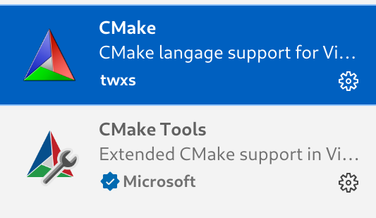
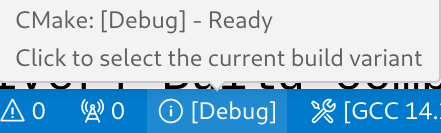

# CMake C++环境搭建
实际上很多IDE上都CMake有支持，常见的如：VScode、Visual Studio、Clion，
当然命令行是最通用的方法，这些都不是必要的，只是有高亮和补全会更友好。

- 首先需要安装CMake

- 对于VScode 需要安装下面两个插件，支持高亮和部分补全 

> 安装CMake插件后可能没有完全展示状态条,需要在.vscode/settings.json中加上 
`"cmake.options.> statusBarVisibility": "compact"`
 
## CMake插件的状态栏功能介绍
显示[Debug]是指构建的时候会使用Debug作为构建类型,可以选择的有Debug、Release、RelWithDebInfo 和 MinSizeRel
构建类型会影响下面的内容(影响的命令行参数以GCC为例)：
1. 优化级别: [-O1,-O2,-O3]
2. 是否可执行文件包含`调试信息`: [-g]
3. 代码中assert是否存在: [-DNDEBUG]
4. 
Debug: 带有Debug信息，支持断点。
Release：没有Debug信息，不支持断点，启用代码优化。
RelWithDebInfo：
