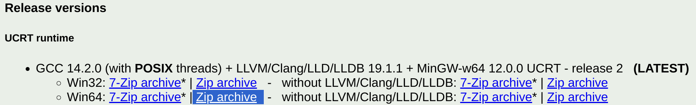
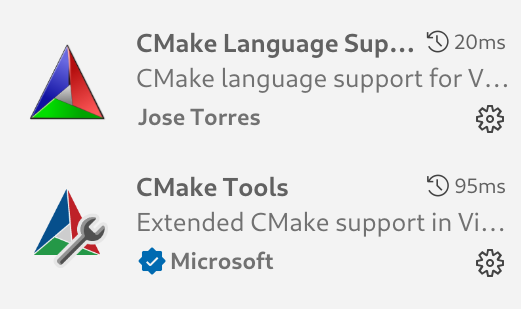
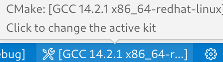

# CMake C++环境搭建
## C++编译器安装
本教程主要讲解Windows上编译器的安装，仅介绍下面三种安装方式：
### 1. Visual Studio[推荐]：
安装Visual Studio并勾选Desktop development with C++[VS install](https://learn.microsoft.com/zh-cn/cpp/build/vscpp-step-0-installation?view=msvc-170)
### 2. Scoop(命令行安装工具):
首先在PowerShell执行[scoop官网](https://scoop.sh/)的脚本，
进入[winlibs](https://scoop.sh/#/apps?q=winlibs)的搜索结果页面
随意选择一个包，并在PowerShell中执行对应的安装命令，例如下面的命令：

> 执行这里的命令(scoop install main/mingw-winlibs)会自动将编译器的可执行文件所在目录添加进环境变量，使得PowerShell中能够直接使用g++、gcc了，以及VScode的插件和CMake能够找到对应路径下的编译器。
### 3. 手动安装[winlibs](https://winlibs.com/)：
推荐下载图中的压缩包(也可以下载右边的不带LLVM的版本，体积更小)，解压后把g++.exe所在目录加入环境变量既可

## CMake环境准备和插件配置
实际上很多IDE上都CMake有支持，常见的如：VScode、Visual Studio、Clion，
当然命令行是最通用的方法，这些都不是必要的，只是有高亮和补全会更友好。
 
- 首先需要安装CMake
- 对于VScode 需要安装下面两个插件，支持高亮和部分补全 

> 安装CMake插件后可能没有完全展示状态条,需要在.vscode/settings.json中加上 
`"cmake.options.> statusBarVisibility": "compact"`
 
## CMake Tools插件的具体功能
安装CMake Tools后状态栏会有我们常用的几个功能，下面介绍一下这些功能具体作用。
### 构建类型
  
图中[Debug]是指构建的时候会使用Debug作为构建类型,可以选择的有Debug、Release、RelWithDebInfo 和 MinSizeRel
构建类型会影响下面的内容(影响的命令行参数以GCC为例)：

1. 优化级别: [-O1,-O2,-O3]
2. 可执行文件是否包含`调试信息`: [-g]
3. 代码中assert是否起作用: [-DNDEBUG]  
>Debug: 带有Debug信息，支持断点  
Release：没有Debug信息，不支持断点，启用代码优化(性能)。  
RelWithDebInfo：启用代码优化，带有Debug信息，断点可能不准  
MinSizeRel：启用代码体积优化  

### 编译器工具链  
  
图中 `[GCC 14.2.1 x86_64]` 指 CMake 构建使用的编译器工具链，可能的选择包括：    
>  **MSVC (Microsoft Visual C++)**: Windows 平台下的主流编译器，通常通过 Visual Studio 或 MSBuild 安装。  
>  **MinGW/MinGW-w64**: 提供 GCC 工具链的 Windows 版本，可以通过安装 MinGW-w64（例如 `winlibs`）。  
>  **Clang**: 一个跨平台的现代编译器。

`工具链`不仅仅是指编译器，还包括构建和链接过程所需的其他工具和配置。

工具链

编译器（Compiler）: 例如 g++、cl.exe 或 clang++，用于将 C++ 源代码编译为目标文件。 
链接器（Linker）: 例如 ld 或 MSVC 自带的链接工具，用于将目标文件链接成可执行文件或库。  
归档工具（Archiver）: 例如 ar，用于生成和管理静态库。   
调试器（Debugger）: 例如 gdb 或 Visual Studio 调试工具，用于调试程序运行。   
构建工具（Build Tools）: 例如 make 或 ninja，用于执行构建规则。   

### 选择构建目标、调试、运行

- 最左的是选择构建目标，也就是选择生成的可执行文件(.exe)，或者构建的其他类型的目标  
- 中间的是debug模式运行，当使用Debug|RelWithDebInfo模式或者构建了带有debug信息的程序有效  
- 最右是运行，直接运行  

下一章[现代CMake的核心概念](现代CMake的核心概念.md)